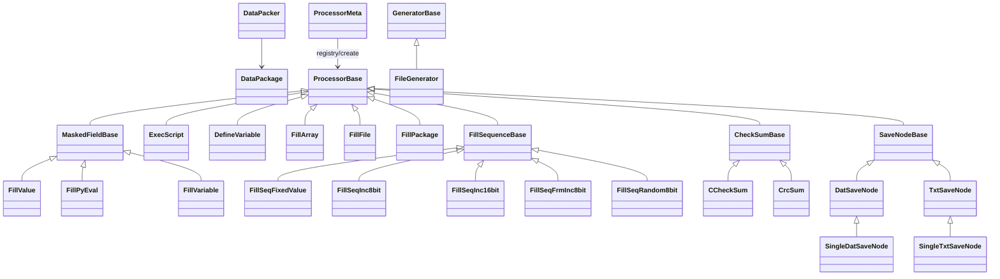
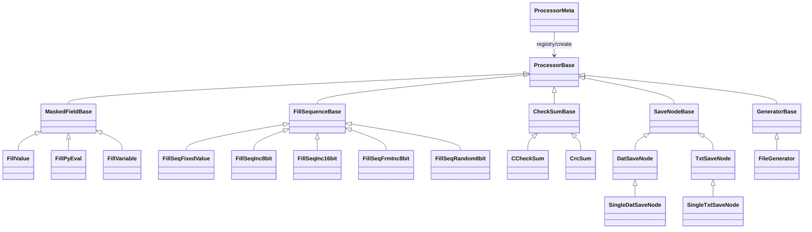

<!-- title:DataPacker通用造数软件使用说明 -->

- [程序功能说明](#%E7%A8%8B%E5%BA%8F%E5%8A%9F%E8%83%BD%E8%AF%B4%E6%98%8E)
- [快速开始](#%E5%BF%AB%E9%80%9F%E5%BC%80%E5%A7%8B)
  - [目录结构](#%E7%9B%AE%E5%BD%95%E7%BB%93%E6%9E%84)
  - [最小配置示例](#%E6%9C%80%E5%B0%8F%E9%85%8D%E7%BD%AE%E7%A4%BA%E4%BE%8B)
  - [运行](#%E8%BF%90%E8%A1%8C)
- [程序使用说明](#%E7%A8%8B%E5%BA%8F%E4%BD%BF%E7%94%A8%E8%AF%B4%E6%98%8E)
  - [加载方案目录](#%E5%8A%A0%E8%BD%BD%E6%96%B9%E6%A1%88%E7%9B%AE%E5%BD%95)
  - [查看帮助信息](#%E6%9F%A5%E7%9C%8B%E5%B8%AE%E5%8A%A9%E4%BF%A1%E6%81%AF)
- [配置文件说明](#%E9%85%8D%E7%BD%AE%E6%96%87%E4%BB%B6%E8%AF%B4%E6%98%8E)
  - [GlobalSavePath](#globalsavepath)
  - [LoadScript](#loadscript)
- [Package详细说明](#package%E8%AF%A6%E7%BB%86%E8%AF%B4%E6%98%8E)
  - [Package子节点](#package%E5%AD%90%E8%8A%82%E7%82%B9)
  - [Package属性](#package%E5%B1%9E%E6%80%A7)
  - [SaveNode](#savenode)
- [Fields和处理节点说明](#fields%E5%92%8C%E5%A4%84%E7%90%86%E8%8A%82%E7%82%B9%E8%AF%B4%E6%98%8E)
  - [Field和vField](#field%E5%92%8Cvfield)
  - [通用属性介绍](#%E9%80%9A%E7%94%A8%E5%B1%9E%E6%80%A7%E4%BB%8B%E7%BB%8D)
- [处理节点额外属性详细说明](#%E5%A4%84%E7%90%86%E8%8A%82%E7%82%B9%E9%A2%9D%E5%A4%96%E5%B1%9E%E6%80%A7%E8%AF%A6%E7%BB%86%E8%AF%B4%E6%98%8E)
  - [变量使用](#%E5%8F%98%E9%87%8F%E4%BD%BF%E7%94%A8)
  - [DefineVariable](#definevariable)
  - [ExecScript](#execscript)
  - [FillPyEval](#fillpyeval)
  - [FillVariable](#fillvariable)
  - [FillValue](#fillvalue)
  - [FillArray](#fillarray)
  - [FillFile](#fillfile)
    - [生成器说明](#%E7%94%9F%E6%88%90%E5%99%A8%E8%AF%B4%E6%98%8E)
  - [FillPackage](#fillpackage)
  - [FillSeq\*](#fillseq)
  - [CheckSum\*](#checksum)
  - [CrcSum](#crcsum)
  - [CCheckSum](#cchecksum)
- [配置文件编写流程](#%E9%85%8D%E7%BD%AE%E6%96%87%E4%BB%B6%E7%BC%96%E5%86%99%E6%B5%81%E7%A8%8B)
- [Python/C扩展](#pythonc%E6%89%A9%E5%B1%95)
  - [Python扩展](#python%E6%89%A9%E5%B1%95)
  - [C扩展](#c%E6%89%A9%E5%B1%95)
    - [CMakeList.txt](#cmakelisttxt)
    - [cmake编译指令](#cmake%E7%BC%96%E8%AF%91%E6%8C%87%E4%BB%A4)
    - [csample文件](#csample%E6%96%87%E4%BB%B6)
    - [对应自定义脚本](#%E5%AF%B9%E5%BA%94%E8%87%AA%E5%AE%9A%E4%B9%89%E8%84%9A%E6%9C%AC)
- [派生类关系图](#%E6%B4%BE%E7%94%9F%E7%B1%BB%E5%85%B3%E7%B3%BB%E5%9B%BE)


# 程序功能说明
DataPacker是一款通用造数软件，以XML配置文件驱动的命令行程序，没有图形界面。
通过修改配置文件、Python脚本扩展和C扩展就可以实现绝大部分数据打包格式，而无需修改主程序。  
它支持以下功能：   
1. 支持多层嵌套格式
2. 支持生成变长帧，初始输入参数时确认变长字段长度，后续每帧长度相同，并非每帧长度变化。
3. 支持定义和使用变量节点
4. 支持调用python函数或者python文件
5. 支持多种数据源，文件，子包格式，数据序列等
6. 文件数据源支持使用生成器对数据文件进行预处理，比如需要对源文件填充
7. 支持多种校验格式
8. 支持多种存储节点，存储二进制文件，txt文件等
9. 支持使用C语言扩展，常用于校验扩展，提升计算性能
10. 可自定义扩展处理节点   

编译/打包说明：见 [BUILD.md](BUILD.md)

# 快速开始
## 目录结构
```
DataPacker/
  dp_config.ini
  config/
    测试xor64/
      config.xml
```

`dp_config.ini` 示例：
```ini
[General]
root_path=config/
```

## 最小配置示例
使用现成的 `config/测试xor64/config.xml`：
```xml
<?xml version="1.0" encoding="UTF-8"?>
<config>
    <GlobalSavePath save_path="output" config_named="1" time_named=""/>
    <Package var_flag="1">
        <Fields name="测试xor64bit" fill_with="0" max_size="16">
            <Field class="FillFile" name="数据" offset="0" size="8" fill_with="0" input="file_input" var_flag="1"/>
            <Field class="CCheckSum" name="xor64" offset="8" size="8" ck_start="0" ck_size="8" ck_func="xor64bit" byteorder="big"/>
        </Fields>
        <SaveNode class="DatSaveNode"/>
    </Package>
</config>
```

## 运行
在工程根目录执行：
```bash
python main.py -c "config/测试xor64"
```
按提示输入一个数据文件路径，生成结果默认输出到 `./output`。


# 程序使用说明
DataPacker是命令行程序，没有图形界面，双击exe即可运行。  
1. 双击执行：默认使用交互模式运行（无需参数）。可使用-u参数改为使用默认参数执行，需在配置文件中指定默认参数。
2. 选择方案：运行后首先需要选择需要执行的方案目录的序号(也可通过-n指定执行序号)，**以双下划线开头的方案目录会被屏蔽不会出现在选项中**
3. 输入参数：确定方案后，交互模式下需要输入参数，完成输入即可开始生成数据
4. 查看结果：生成时有进度条显示，执行出错会有报错信息显示。执行完毕后可按照提示退出或打开输出文件夹；保存节点会在执行结束时自动close并落盘。   

## 加载方案目录
datapacker默认会根据dp_config.ini配置的路径加载方案，配置异常则从config目录下加载。   
方案目录下的每个子文件夹都视为一个单独的方案，每种方案的主配置文件必须命名为config.xml，其他文件（扩展脚本）可自定义命名(必须位于同一方案目录中)。  
datapacker有**三种运行模式**：默认交互模式（控制台输入参数）、`-u`默认参数模式（使用节点默认值）和`-b`后台模式（使用`input_value`参数）。使用默认参数/后台模式请确保配置文件中的参数正确。
datapacker命令行加载方案目录有三种方式：
1. 直接运行exe：程序会查找当前路径下的config目录，将其子目录作为方案目录打印并编号，用户输入序号选择方案执行。
2. 使用-n指定配置文件编号，文件编号和方法1的编号相同，此方法使用的方案也在config目录下。
3. 使用-c指定配置文件路径，参数可选择方案目录或方案的config.xml文件。可拖动文件到控制台输入。

**建议配合前端软件(DatapackerEdit.exe)使用, 提供更方便快捷的UI操作**

## 查看帮助信息
输入datapacker.exe -h可查看帮助信息：
``` bash
datapacker.exe -h
usage: datapacker.exe [-h] [-u | -b] [-d] [-c CONFIG_DIR] [-n CONFIG_NUM] [-s] [-p] [-t TEST_FLAG]

options:
  -h, --help            show this help message and exit
  -u, --use_default     使用默认参数运行, 确保配置文件满足参数需求
  -b, --background_mode
                        后台模式运行, 使用配置文件中的input_value参数运行
  -d, --debug           debug模式, 默认不捕获异常
  -c, --config_dir CONFIG_DIR
                        配置文件路径
  -n, --config_num CONFIG_NUM
                        配置文件序号
  -s, --shm_enable      enable shared memory output, only background mode use
  -p, --progress_bar_disable
                        禁用显示进度条
  -t, --test_flag TEST_FLAG
                        测试模式, -t n:开启测试模式, 显示n个最耗时函数, 用于分析耗时
```


# 配置文件说明
DataPacker程序的行为全部通过配置文件定义，所以编写配置文件非常重要，以下是配置文件格式的详细说明。   
配置文件格式如下，根节点下有三种子节点：GlobalSavePath，LoadScript和Package，详细定义见下文。   

## GlobalSavePath
GlobalSavePath节点用于定义全局存储路径，节点未定义时使用当前路径的output目录。支持以下属性
- save_path：输出目录，默认 ./output
- config_named：bool值，是否创建输出方案文件夹
- time_named：bool值，是否创建输出时间文件夹


## LoadScript
LoadScript用于加载Python脚本扩展，支持以下属性：
- script_file：加载自定义的处理节点脚本文件。使用相对路径，指定的文件必须位于方案目录下，也就是和config.xml同级目录。   
  项目使用reflector机制，可通过配置中的字符串构建处理节点类，扩展脚本的类必须继承ProcessorBase，在config.xml中使用class名称即可调用。


# Package详细说明
## Package子节点
Package用于定义包格式，有两种子节点:    
- Fields, 用于定义具体的包格式信息，它包括Field和vField两种子节点用于定义处理节点。
- SaveNode, 用于定义存储方式，原生支持存储为单个dat文件，单个txt文件，以及每包存储为一个dat或txt文件，可自定义扩展脚本。    

## Package属性
- save_flag: bool值，保存节点标志。当且仅当未配置SaveNode且save_flag=True时，自动使用默认DatSaveNode；配置了SaveNode时此标志不生效。后续将弃用。
- var_flag: bool值，变长包标识，用于重定义数据源长度以支持变长帧。指定为True时表示Package为变长包，此时数据源Field(FillFile,FillPackage,FillSeq*)中的var_flag才有效。  
- not_caller: bool值，非主动调用标识, 默认为False(主动调用)。通常用于父包格式中包含多个子包格式的情况。
**注意，配置中所有bool类型属性的输入规则统一为：属性值不为空为True，属性值为空表示False**


## SaveNode
SaveNode用于定义存储节点行为, 默认支持以下4种存储方式: 
- DatSaveNode, 存储为整个dat文件；当未配置SaveNode且save_flag=True时自动使用该存储节点。
- TxtSaveNode, 存储为整个txt文件
- SingleDatSaveNode, 存储单个dat文件，存储在子文件夹中，以序号命名
- SingleTxtSaveNode, 存储单个txt文件，存储在子文件夹中，以序号命名  

以上4种存储节点都支持以下通用属性：
- name, 节点名称（用于日志/定位）
- filename, 输出文件名（不含扩展名），不指定则使用package.name
- prefix, 命名前缀，如有需要可使用
- suffix, 命名后缀，txt文件默认为.txt，dat文件默认为.dat，无需显示指定。例，dat文件可通过此属性改为.bin。   
- fmt_name, 格式化文件名，使用Python format风格，变量使用花括号包围。支持以下变量索引：
  - p#序号: 按顺序索引Package（从0开始），例如 {p#0.max_size}
  - p@名称: 按Package名称索引（Fields节点name），例如 {p@flash上注.max_size}
  - 字段索引: 在Package后加 .f#序号 或 .f@名称，例如 {p#0.f#0.value} 或 {p@flash上注.f@航天器标识.value}
  - 示例：
  - 纯字段值：`fmt_name="{p#0.max_size}"` → 输出 `max_size` 的值
  - 前后缀拼接：`fmt_name="pkt_{p@flash上注.max_size}_v1"`
  - 格式化数字宽度：`fmt_name="seq_{p#0.f#0.value:04d}"`
  - 混合多字段：`fmt_name="{p#0.name}_{p#0.f@航天器标识.value}"`
- offset, size：可选，仅保存数据帧的指定片段（等同切片）

TxtSaveNode和SingleTxtSaveNode支持属性：
- sep, 指定每个字节之间的分隔符, 输入单个字符

SingleDatSaveNode和SingleTxtSaveNode额外支持属性：
- sub_path, 子目录名称，默认<filename>_dat / <filename>_txt

SaveNode生命周期说明：
- SaveNodeBase提供close()用于关闭文件句柄
- 程序执行结束会依次调用每个SaveNode的close()，不再像之前必需关闭程序才能实际落盘。
- 自定义SaveNode建议继承SaveNodeBase或实现close()方法以释放资源

文件命名规则：prefix + filename + suffix；Single*会在文件名后追加序号并输出到sub_path目录，序号宽度为`max(6, digits(max_pkg))`，不足左侧补0   


# Fields和处理节点说明
Fields节点的属性有：name，max_size，fill_with，content。这四种属性和遥控遥测配置类似，具体含义如下：   
- name, 包格式名称，存储节点不配置文件名时使用此name作为文件名。
- max_size, 包格式最大长度。
- fill_with, 包格式数组首先使用fill_with填充，类似memset。
- content, 十六进制字符串，可带空格。fill_with之后使用content填充包格式数组。

Fields节点有两种子节点：Field和vField，用于定义具体包格式处理节点。   
两种节点都需要通过class属性指定处理节点类，区别在于Field是用于定义数据格式的节点，必须定义offset和size属性；   
而vField是虚拟处理节点，此类型无需offset和size, 每种vField所需的属性不同，详细信息参见下文。   

## Field和vField
下表介绍了所有处理节点的通用属性：
| class名称 | 功能 | tag | 默认fixed | 默认priority | 输入类型 | 额外属性 |
|---|---|---|---|---|---|---|
| FillValue | 填充整型值 | Field | True | 0 | combo_box,line_edit | value,mask,byteorder |
| FillPyEval | 填充脚本返回值 | Field | False | 0 | combo_box,line_edit | value,mask,byteorder,eval |
| ExecScript | 执行脚本 | vField | False | 0 | 否 | script_file,script_line |
| DefineVariable | 定义变量 | vField | True | 0 | combo_box,line_edit | var_name,value |
| FillVariable | 填充变量 | Field | False | 0 | 否 | var_name,mask,byteorder |
| FillArray | 填充数组 | Field | True | 0 | line_edit | value |
| FillFile | 填充文件(数据源) | Field | True | 99 | file_input | filename,fill_with,generator,var_flag |
| FillPackage | 填充包格式(数据源) | Field | False | 99 | 否 | pkg_name,caller,eval,var_flag |
| FillSeq* | 填充序列类集合(数据源) | Field | True(当max_pkg>1时自动变为False) | 99 | line_edit | max_pkg,[fixed_value]  |
| CrcSum | Crc校验 | Field | False | -99 | 否 | ck_start,ck_size,crc_type |
| CCheckSum | C扩展校验类 | Field | False | -99 | 否 | ck_start,ck_size,lib_file,ck_func,byteorder |


## 通用属性介绍
上表只介绍了部分通用属性，还有部分通用属性并未列出，由下文来介绍并进行详细说明。
1. name：节点名称。所有节点都必须定义，即使是无实际含义的vField，可以方便排查问题。
2. class：处理节点类名称，可从上述表格中选择使用。
3. offset和size：当前节点的偏移和长度。仅Field节点支持，vField节点无需定义。
4. fixed：bool值，fixed属性表明当前处理节点是固定参数或可变参数，每种处理节点都有默认值（见上表），可通过配置修改重新指定。固定参数程序只执行一次，可变参数节点按priority排序后每组一帧按顺序执行一次。
5. priority：整形值，优先级仅fixed=False时有效。程序会根据优先级从大到小排序处理节点，普通节点默认优先级0，数据源节点默认优先级99，校验节点（通常最后计算）默认优先级-99。
6. input：输入类型包括combo_box, line_edit和file_input，处理节点可用的输入类型见上表。   
   对于命令行程序file_input和line_edit行为一致；对于DataPacker界面程序file_input会显示为文件输入框，而line_edit会显示为文本输入框      
   input字段对应的值类型:  
   - combo_box类型有额外的opt_value和opt_text属性；输入时会打印如何格式：序号-值(opt_value)-参数文本(opt_text)，输入选择的序号，由子类转换为序号对应的值。 
   - line_edit支持FillValue，DefineVariable，FillArray和FillFile四种节点。FillValue和DefineVariable仅支持输入整形变量，FillArray仅支持输入十六进制字符数组。FillFile支持输入文件路径。   
7. input_value: 每个支持input的节点都支持input_value属性，它在background_mode模式中使用,用于替换手动输入参数。   
8. 额外属性由每个节点在下文单独介绍。

# 处理节点额外属性详细说明
## 变量使用
变量的使用和以下四个处理节点息息相关，分别是：DefineVariable，ExecScript，FillPyEval和FillVariable。   
为了方便扩展，满足组包时的变化数据要求，程序支持通过DefineVariable节点定义变量，可通过ExecScript执行脚本修改变量，可通过FillPyEval和FillVariable节点使用变量。   
变量包含全局变量和局部变量，程序默认定义了以下变量：   
顾名思义，下面是四个变量的含义：   
- _max_pkg：全局变量，最大包数量。当前实现按参与执行节点中的最大值确定。
- _cur_pkg：全局变量，当前包计数，从0开始计数，通常可用于填充帧计数
- _pkg_data：局部变量，当前包数据，外部函数可拿到当前包的完整数据，请确认offset和size值确保只修改与当前处理节点匹配的部分。也可用于计算校验时访问全部数据
- _pkg_len：局部变量，当前包长度，等于Fields.max_size。变长包时自动更新
- _dat_len：局部变量，当前包的数据源长度，由数据源处理节点负责更新此变量。

全局变量是所有Package节点中都可访问，而局部变量的作用域只能在Package内部使用，通过配置文件定义的变量也属于局部变量。   
ExecScript修改变量可影响到程序内部，而FillPyEval虽然也可修改使用和修改变量值，但不能影响程序内部值，两者调用的作用域不同。   


## DefineVariable
DefineVariable用于定义变量，可在ExecScript，FillPyEval和FillVariable中使用。支持以下属性：   
- var_name：定义变量名称，对于程序内部来说本质是字符串，无命名要求，但建议使用通用的编程变量命名规则。
- value：变量初始值，仅支持整形。   
- input：支持combo_box和line_edit。   


## ExecScript
ExecScript支持调用脚本文件片段，通常用于修改配置中定义的变量。支持以下属性:   
- script_file: 指定脚本文件名，只需要指定文件名称，并且脚本文件必须位于方案目录下。   
- script_line: 支持单行脚本，当脚本语句中有引号问题时可将脚本写在text里, 属性优先级高于text   


## FillPyEval
FillPyEval可调用脚本扩展，需要定义eval属性，和遥控遥测的eval功能类似，FillPyEval会加载方案目录下的py_eval.py文件，调用其中的pyStr2Bytes函数执行eval定义。  
FillPyEval支持返回bytearray和int类型，其中返回int类型时可以支持mask和byteorder参数
支持以下属性：   
- eval: 调用表达式字符串。
- mask: 掩码, 仅返回int类型时使用
- byteorder: 字节序, 仅返回int类型时使用，可选["big","little"]
- value: 默认参数，以及有input时存储输入参数。当前实现按整数解析（支持十进制和0x十六进制），脚本中可使用val变量获取
- input: 支持输入参数。当前实现按整型输入处理

FillPyEval可以访问配置文件中定义局部变量或者全局变量，虽然方便使用但每次调用都需要组装上下文并执行一次eval，性能开销仍高于普通节点，建议尽量少使用。   


## FillVariable
FillVariable可使用已有的变量填充数据帧中的字段。支持以下属性：
- mask: 支持掩码，以带0x的16进制表示，比如0xf0，表示高4bit有效。
- var_name：指定需要填充的变量名，必须是已存在的变量，填充时会做存在性检查，填充的变量值默认都会转换为大端。
- byteorder：可选["little" | "big"]，默认big


## FillValue
FillValue通常作为填充固定值（比如帧头之类的）。支持以下属性：
- mask: 支持掩码，以带0x的16进制表示，比如0xf0，表示高4bit有效。
- value：默认填充的固定值。只支持整形输入，可输入十进制或者带0x的十六进制。可被输入值覆盖。
- input：可选combo_box和line_edit。
- byteorder：可选["little" | "big"]，默认big


## FillArray
FillArray用于使用十六进制字符串填充数组。支持以下属性：   
- value：填写十六进制字符串，不带0x。 
- input：支持line_edit输入十六进制字符串


## FillFile
FillFile用于填充文件，有两种使用方式：1是当fixed=false时作为数据源；2是当fixed=true是作为填充文件，可作为FillArray的补充。支持以下属性：   
- filename，指定输入文件的全局路径，或者相对路径。使用相对路径时会以“方案目录 -> 当前工作目录”的顺序查找文件。
- fill_with，当文件不足指定长度时的填充值。
- generator，指定文件生成器（基于Python生成器实现），用于对文件进行预处理。生成器扩展文件必须放在方案目录下，输入形式为`模块名:生成器类名`，注意模块名相当于不带后缀的文件名，例`generator:FillTxtFile`。   
- var_flag, 变长帧标识, bool值。使用此标识时可在输入参数时重新定义长度 
- input，只支持file_input方法。输入文件路径，可将文件拖动到命令行窗口输入。

### 生成器说明
生成器简而言之就是必须使用关键字`yield`返回，下次调用时会接着`yield`下一条语句执行，而不是从函数开始执行，详细概念见python文档。   
增加生成器的作用是为了满足对文件进行预处理的需求，比如输入文本文件输出bin文件，比如文件帧数填充到16的整数倍等需求。      
生成器有基类，位于backend.processor.ProcessorBase.GeneratorBase，基类定义了对生成器的基础要求如下，但并非强制要求生成器必须继承基类，满足基础要求即可被datapacker调用。
1. 实现__iter__方法并返回生成器，返回值是bytearray
2. 构造函数接受filename和size两个参数
3. 计算出最大包数max_pkg属性
4. 上报错误请抛出异常
文件帧数填充到16整数倍的示例代码如下：
``` python
import os


class Fill16Gen:
    def __init__(self, filename: str, size: int):
        self.size = size
        self.cur_pkg = 0
        self.max_pkg = 0

        self.ifd = open(filename, "rb")
        if self.ifd is None:
            raise RuntimeError(f"file open failed: {filename}")

        file_sz = os.path.getsize(filename)
        # 计算max_pkg
        self.max_pkg = (file_sz + self.size - 1) // self.size
        self.max_pkg = (self.max_pkg + 15) // 16 * 16  # 必须是16的整数倍
        if self.max_pkg <= 0:
            raise RuntimeError(f"file size invalid: {filename} {file_sz}")

    # 实现__iter__
    def __iter__(self):
        temp = bytearray(self.size)
        read_buf = bytearray(self.size)
        while self.cur_pkg < self.max_pkg:
            read_len = self.ifd.readinto(read_buf)
            if read_len > 0:
                yield read_buf
            else:
                yield temp
            self.cur_pkg += 1
```


## FillPackage 
FillPackage用于获取其他包数据作为数据源。有两种使用方式：1是当fixed=false时作为数据源；2是当fixed=true时作为填充文件。支持以下属性：   
- pkg_name，指定源包名称。加载时做存在性检查，因此被调用的包必须先于当前包定义。
- fill_with, 填充字段，源包长度不足size时填充，不指定时默认用Fields.fill_with。
- caller, bool值，主动调用子包的pack函数，适用于外层格式中包含多个子包的情况，配合子节点Package的not_caller使用，not_caller表示子包不主动调用
- eval, 重新计算包数量的脚本表达式，通常只用于显示调用caller的情况。支持以下变量：
    ``` python
    # 通常用于主动调用子包时重新计算最大包数量
    local_vars = self.package.local_vars.copy()
    # 兼容以前配置
    local_vars["_max_pkg"] = self.src_pkg._max_pkg  # =src_max_pkg
    local_vars["_pkg_len"] = self.src_pkg.max_size  # =src_pkg_len
    local_vars["src_max_pkg"] = self.src_pkg._max_pkg  # 源包最大包数
    local_vars["src_pkg_len"] = self.src_pkg.max_size  # 源包最大包长度
    local_vars["cur_pkg_len"] = self.package.max_size  # 当前包长度
    local_vars["cur_dat_len"] = self.size  # 当前数据长度
    ```
    通常计算方式为：`(_max_pkg+子包数量-1)/子包数量`
- var_flag, bool值，变长包标识。
    **注意**: FillPackage可以自动继承子包的变长包属性，此时FillPackage.size会自动适应子包max_size。   
    而额外的var_flag标识适合子包长度和FillPackage节点无关联的情况使用。即不管子包长度变长或非变长，FillPackage节点需要单独变长时使用；   
    注意，变长时子包长度可以小于但不能大于FillPackage.size，小于时使用默认填充


## FillSeq*
FillSeq*是填充序列类的集合，作为FillSequence的替代，主要将FillSequence中的seq_type换成了具体的类类型, 包括以下类:
- FillSeqFixedValue, 填充固定值，支持输入fixed_value属性
- FillSeqInc8bit, 填充8bit递增码
- FillSeqInc16bit, 填充16bit递增码
- FillSeqFrmInc8bit, 填充帧间递增码
- FillSeqRandom8bit, 填充8bit随机码
它们支持以下属性：
- var_flag, 用于定义变长包模式
- max_pkg, 作为数据源时使用，非数据源时可不用或者赋值1。支持line_edit方式输入。
- fixed, bool值。默认为True，通常无需手动赋值，受max_pkg值影响，max_pkg<=1时作为非数据源fixed=True,否则为False。


## CheckSum*   
CheckSum*校验类在当前版本中包含`CrcSum`和`CCheckSum`两类实现（见源码`backend/processor/CheckSum.py`），两者都支持以下属性：
- ck_start：校验起始位置，从0开始的下标。
- ck_size：校验数据长度。


## CrcSum
CrcSum用于计算Crc校验，它使用libscrc库(基于C)实现，性能强校验快，并且支持所有crc校验方式，推荐使用。它支持以下属性：
- ck_start：校验起始位置，从0开始的下标。
- ck_size：校验数据长度。
- crc_type：指定crc校验类型字符串，所有crc校验类型参考下列资料。常用校验类型: ccitt_false
- byteorder：可选["little" | "big"]，默认big

libscrc参考链接：[PyPI](https://pypi.org/project/libscrc/) [Github](https://github.com/hex-in/libscrc)   
CrcSum使用配置：   
`<Field name="CRC校验" offset="894" size="2" class="CrcSum" crc_type="ccitt_false" ck_start="4" ck_size="890"/>`

CrcSum实现代码：
``` python
import libscrc
import ctypes


class CrcSum(CheckSumBase):
    """通用CRC校验和, 依赖libscrc库
    通过crc_type属性指定CRC类型, 默认ccitt_false
    """

    def __init__(self):
        super().__init__()

    def load(self, xml_node):
        super().load(xml_node)

        self.crc_type = xml_node.attrib.get("crc_type", "ccitt_false")
        if not hasattr(libscrc, self.crc_type):
            raise RuntimeError(f"{self.package.name}-{self.name}: crc_type not support: {self.crc_type}")
        self.crc_func = getattr(libscrc, self.crc_type)

    def pack(self, data, /, **kwargs) -> bool:
        crc_val = self.crc_func(data[self.ck_start : self.ck_start + self.ck_size])
        ret = crc_val & ((1 << self.size * 8) - 1)
        data[self.offset : self.offset + self.size] = int(ret).to_bytes(self.size, byteorder="big")
        return True
```


## CCheckSum
CCheckSum是基于C扩展实现的校验类，默认使用`cchecksum.dll`中的函数；也可通过`lib_file`属性指定自定义函数库。若配置了`lib_file`，会优先尝试从该库加载函数，失败时再回落到默认`cchecksum.dll`。   
`lib_file`与默认`cchecksum.dll`使用同一套查找顺序（`sys._MEIPASS`作为兜底）：  
1. 方案目录（`self.xml_path`）
2. `sys.executable`所在目录（exe目录）
3. 启动脚本目录
4. 当前工作目录
5. `sys._MEIPASS`

为了方便代码实现，要求C校验函数使用统一的函数签名`uint64_t (uint8_t* bytes, int len)`，要求返回值uint64_t, 参数为uint8_t指针,len为字节长度。它支持以下属性：
- ck_start：校验起始位置，从0开始的下标。
- ck_size：校验数据长度。
- byteorder：可选["little" | "big"]，默认big   
- lib_file：自定义dll名称（可写`foo`或`foo.dll`，也支持相对/绝对路径）。未指定时使用默认`cchecksum.dll`。   
- ck_func：指定调用的函数名称。ck_func可选函数（以`clibrary/cchecksum/cchecksum.h`为准）:
    ``` c++
    uint64_t sum8bit(uint8_t* bytes, int len);
    uint64_t sum16bit(uint8_t* bytes, int len);
    uint64_t xor8bit(uint8_t* bytes, int len);
    uint64_t xor16bit(uint8_t* bytes, int len);
    uint64_t xor64bit(uint8_t* bytes, int len);
    uint64_t isosum(uint8_t* bytes, int len);
    uint64_t udp_checksum(uint8_t* bytes, int len);
    uint64_t ipv6_checksum(uint8_t* bytes, int len);
    ```
使用示例：`<Field name="和校验" offset="138" size="2" class="CCheckSum" ck_func="isosum" ck_start="0" ck_size="138"/>`   


# 配置文件编写流程
1. 判断数据文件是否需要预处理，需要预处理则得编写生成器
2. 将数据协议中的字段分为四类：
- 固定字段，通常使用FillValue，FillArray填充
- 变化字段，通常通过定义变量(DefineVariable，ExecScript，FillVariable，FillPyEval等类)实现，或者通过自定义处理节点扩展实现。
- 参数可选字段，类似固定字段使用FillValue，FillArray填充，通过input属性指定输入字段
- 校验字段，查看文档的校验类是否满足，不满足可通过Python/C自定义扩展
可按照固定字段，参数可选字段，校验字段，变化字段的顺序编写配置文件，编写完前三种字段后可先生成数据检查下数据是否符合预期，最后在编写调试变化字段参数。   
调试时可先使用小数据量测试，脚本扩展中可使用打印语句调试。   


# Python/C扩展
根据上文中的配置文件介绍可以了解到配置文件中的每一项都对应代码中的一个处理节点类，每个处理节点类都继承自ProcessorBase，包括校验类和存储节点类都继承自它。
ProcessorBase有三个主要的函数，作用如下：
- load：接受一个xml节点，处理该节点所需属性，不满足条件时抛出异常报错
- input：数据函数，根据节点需要可选择性重写。
- pack：接受一帧数据(bytearray类型)，返回bool值，当组包到最后一帧时返回False，通知上层调用退出循环，否则返回True。
**注意**：每个处理节点的pack都接受的完整数据帧，可访问当前帧所有数据。原则上每个节点根据配置的offset和size只修改对应位置的数据，实际上你要一个节点处理多个位置数据也没关系，反而可能更快，但是不通用了。  

## Python扩展
扩展自定义类时必须继承自ProcessorBase类，而它在backend.processor.ProcessorBase模块中，所以import语句写法参考下文示例代码第一行。   
类似的继承校验类的import语句：`from backend.processor.CheckSum import CheckSumBase`。
``` python
from backend.processor.ProcessorBase import ProcessorBase
from pathlib import Path


class SaveDualChannel(ProcessorBase):
    def __init__(self):
        super().__init__()
        self.frm_cnt = 0
        self.fd1 = None
        self.fd2 = None

    def __del__(self):
        self.close()

    def close(self):
        if self.fd1 is not None:
            self.fd1.close()
            self.fd1 = None
        if self.fd2 is not None:
            self.fd2.close()
            self.fd2 = None

    def load(self, xml_node):
        self.filename1 = Path(self.package.global_save_path) / (self.package.name + "_通道1.dat")
        self.filename2 = Path(self.package.global_save_path) / (self.package.name + "_通道2.dat")
        self.fd1 = open(self.filename1, "wb")
        self.fd2 = open(self.filename2, "wb")

    def pack(self, data, /, **kwargs) -> bool:
        if self.frm_cnt % 2 == 0:
            self.fd1.write(data)
        else:
            self.fd2.write(data)
        self.frm_cnt += 1
        return True
```


## C扩展
目前使用的C扩展很简单但也能满足绝大多数需求，将C函数编译成dll库，即可通过ctypes加载dll文件，并通过函数字符串获取函数并调用。   
项目中的clibrary文件夹对应C扩展相关，使用cmake做项目管理，也可以使用其他工具管理项目，编译成dll即可。   
以下是将图像数据由8bit转换为12bit的C函数扩展，在“微纳-可见图像”中的自定义生成器generator.py中调用，代码如下：
### CMakeList.txt
``` cmake
cmake_minimum_required(VERSION 3.20)

set(CMAKE_CXX_STANDARD 17)
set(CMAKE_CXX_STANDARD_REQUIRED ON)

project(csample)


# 生成dll
add_library(csample SHARED csample.c)
target_compile_definitions(csample PRIVATE CSAMPLE_EXPORTS) # 定义导出宏

# 设置动态库的输出目录
set_target_properties(csample PROPERTIES
    RUNTIME_OUTPUT_DIRECTORY ${CMAKE_BINARY_DIR}/bin
    LIBRARY_OUTPUT_DIRECTORY ${CMAKE_BINARY_DIR}/bin
    ARCHIVE_OUTPUT_DIRECTORY ${CMAKE_BINARY_DIR}/bin
)

file(GLOB allCopyFiles  "${CMAKE_CURRENT_SOURCE_DIR}/*.h")
file(COPY ${allCopyFiles} DESTINATION ${CMAKE_BINARY_DIR}/include)
```

### cmake编译指令
```
mkdir build
cd build
cmake ..
cmake --build . --config Release
```

### csample文件
``` c
#ifndef CSAMPLE_H
#define CSAMPLE_H

#include <stdint.h>

#ifdef _WIN32
#ifdef CSAMPLE_EXPORTS
#define CSAMPLE_API __declspec(dllexport)
#else
#define CSAMPLE_API __declspec(dllimport)
#endif
#else
#define CSAMPLE_API
#endif

#ifdef __cplusplus
extern "C" {
#endif

CSAMPLE_API uint64_t lshift4bit(uint8_t* bytes, int len);

#ifdef __cplusplus
}
#endif

#endif  // CSAMPLE_H
```

``` c
#include "csample.h"

uint64_t lshift4bit(uint8_t* bytes, int len)
{
    int times = len / 3;
    for(int i = times - 1; i >= 0; i--)
    {
        int s_ofs = i * 2;
        uint8_t B1 = bytes[s_ofs];
        uint8_t B2 = bytes[s_ofs + 1];

        int d_ofs = i * 3;
        bytes[d_ofs] = B1;
        bytes[d_ofs + 1] = (B2 >> 4) & 0x0F;
        bytes[d_ofs + 2] = (B2 & 0x0F) << 4;
    }
    return len;
}
```

### 对应自定义脚本
``` python
import os
import ctypes
from pathlib import Path

lib_file = Path(__file__).parent / "csample.dll"
if not lib_file.exists() or not lib_file.is_file():
    raise RuntimeError(f"csample.dll not found: {lib_file}")

csample = ctypes.cdll.LoadLibrary(lib_file)
lshift4bit = csample.lshift4bit
# 以上是加载dll和函数的全部代码，下面大部分是业务逻辑无需关心，只需要关心lshift4bit如何调用

class GenP:
    def __init__(self, filename: str, size: int):
        self.size = size
        self.cur_pkg = 0
        self.max_pkg = 0

        file_sz = os.path.getsize(filename)
        if file_sz % (6144 * 8) != 0 and file_sz > 0:
            raise RuntimeError("P谱段数据长度必须是6144*8的整数倍")

        self.ifd = open(filename, "rb")
        if self.ifd is None:
            raise RuntimeError(f"file open failed: {filename}")

        self.max_pkg = file_sz // 6144
        print(f"P谱段数据长度: {file_sz}, 包数: {self.max_pkg} ")

    def __iter__(self):
        frm8_buf = bytearray(6144 * 8)
        db_len = 6144 // 2 * 3
        db_frm = bytearray(db_len)
        while True:
            mod = self.cur_pkg % 8
            if mod == 0:
                self.ifd.readinto(frm8_buf)

            db_frm[0:6144] = frm8_buf[mod * 6144 : (mod + 1) * 6144]
            lshift4bit(ctypes.pointer(ctypes.c_ubyte.from_buffer(db_frm)), db_len)
            yield db_frm
            self.cur_pkg += 1
            if self.cur_pkg >= self.max_pkg:
                break


class GenB:
    def __init__(self, filename: str, size: int):
        self.size = size
        self.cur_pkg = 0
        self.max_pkg = 0

        file_sz = os.path.getsize(filename)
        if file_sz % (1536 * 8) != 0 and file_sz > 0:
            raise RuntimeError("B谱段数据长度必须是1536*8的整数倍")

        self.ifd = open(filename, "rb")
        if self.ifd is None:
            raise RuntimeError(f"file open failed: {filename}")

        self.max_pkg = file_sz // 1536
        print(f"B谱段数据长度: {file_sz}, 包数: {self.max_pkg} ")

    def __iter__(self):
        frm8_buf = bytearray(1536 * 8)
        db_len = 1536 // 2 * 3
        db_frm = bytearray(db_len)
        while True:
            mod = self.cur_pkg % 8
            if mod == 0:
                self.ifd.readinto(frm8_buf)

            db_frm[0:1536] = frm8_buf[mod * 1536 : (mod + 1) * 1536]
            lshift4bit(ctypes.pointer(ctypes.c_ubyte.from_buffer(db_frm)), db_len)
            yield db_frm
            self.cur_pkg += 1
            if self.cur_pkg >= self.max_pkg:
                break
```

# 派生类关系图



